                           # Tidy 5e Sheets

     

D&D 5e sheet layouts for Foundry VTT, focused on a clean UI, user ergonomics, and extensibility.

Completely rewritten from the ground up, based on the [Tidy5e Sheet](https://github.com/sdenec/tidy5e-sheet) module by [sdenec](https://github.com/sdenec) and [4535992](https://github.com/p4535992).

- [Foundry Package](<https://foundryvtt.com/packages/tidy5e-sheet/>)
- [Tidy 5e Sheets API](https://kgar.github.io/foundry-vtt-tidy-5e-sheets/)

> [!CAUTION]
> ⚙️ ***Quadrones have gone rogue!*** 🤖  
> The [UI Overhaul Open Beta](<#tidy-5e-sheets-ui-overhaul-beta>) has begun!

---

## How to Support the Team

### _**kgar**_ - 📜 Keeper of Sheets, 👨‍💻 development, ✨ some design

 

### _**hightouch**_ - ✨ design, 👨‍💻 some development

## Community Discord

Join us on the [Tidy 5e Sheets community discord](https://discord.gg/865zzNscRA) to receive insider updates, dream up new features, report bugs more easily than github, and much more.

## Installation

It is preferable to install this module through Foundry, the Forge bazaar, or a similar interface for official Foundry packages.
However, you are also able to install via URL.

Manual installation instructions:

1. Inside the Foundry "Configuration and Setup" screen, click "Add-on Modules"
2. Click "Install Module"
3. In the "Manifest URL" field, paste in a manifest URL. The "Latest Stable" URL is: 
   `https://github.com/kgar/foundry-vtt-tidy-5e-sheets/releases/latest/download/module.json`
   - See [the foundry package page](<https://foundryvtt.com/packages/tidy5e-sheet/>) for Last Versions for different dnd5e system versions.
4. Click 'Install' and wait for installation to complete
5. Enable the module in your game using the "Manage Module" button.
6. Select the sheet layout from these options, depending on which sheet you are using:
   - Tidy 5e Character Sheet
   - Tidy 5e NPC Sheet
   - Tidy 5e Vehicle Sheet
   - Tidy 5e Item Sheet

## Tidy 5e Sheets UI Overhaul Beta

> [!IMPORTANT]
> From **kgar**:
> Do you like what you see? Please consider thanking hightouch for giving us his time and expertise in graphic design by visiting his [ko-fi](<https://ko-fi.com/hightouch>). This is all volunteer work, but saying thanks with a cup of coffee is a gesture that goes a long way!
> 
> The community has been generous to me for my efforts with this module. With that said, this next chapter in Tidy's history is, in a large part, thanks to hightouch's willingness to give of himself and work with the community and me to give Tidy an amazing new look while preserving all the functional things that users have come to rely upon.

The new Tidy 5e Sheets graphical overhaul, codenamed Quadrone, has begun, and we are gradually releasing new sheets into the beta.

Item Sheets Progress:  
✅ Background  
✅ Class  
✅ Consumable  
✅ Container  
✅ Equipment  
✅ Facility  
✅ Feat  
✅ Loot  
✅ Species  
✅ Spell  
✅ Subclass  
✅ Tattoo  
✅ Tool  
✅ Weapon  

Actor Sheets Progress:  
⬜ Character  
⬜ Group  
⬜ NPC  
⬜ Vehicle  

_**Behold**_:

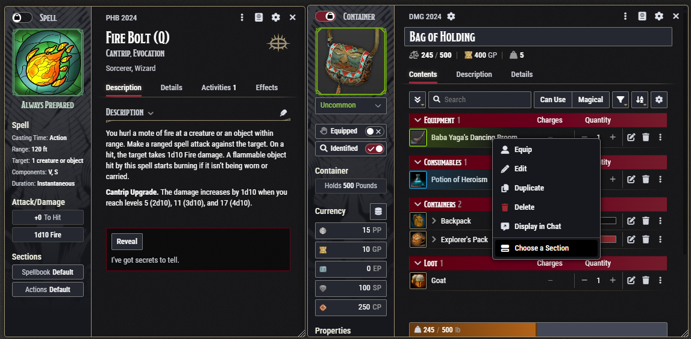

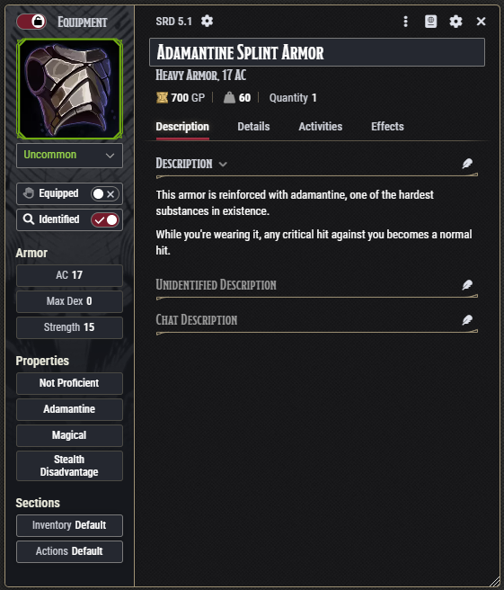

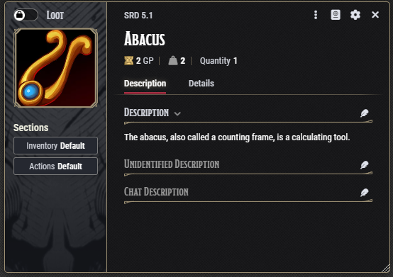

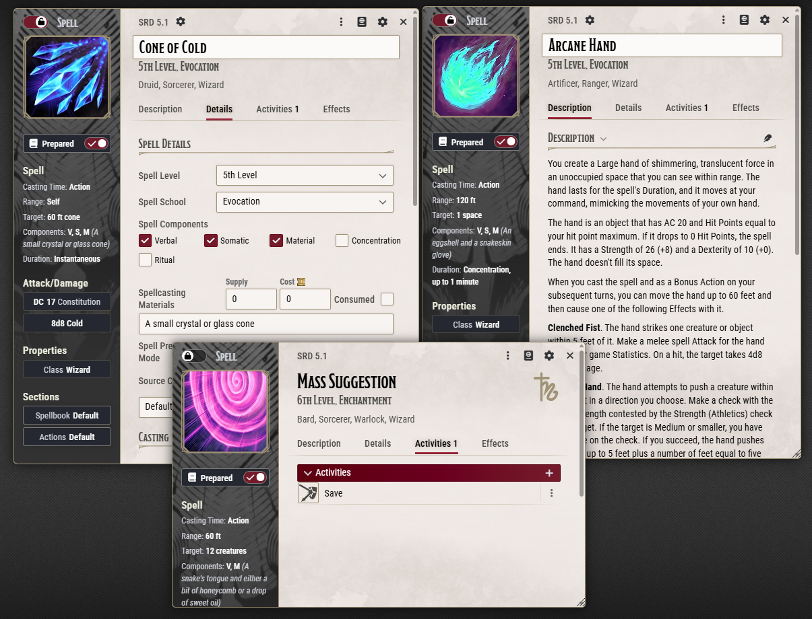

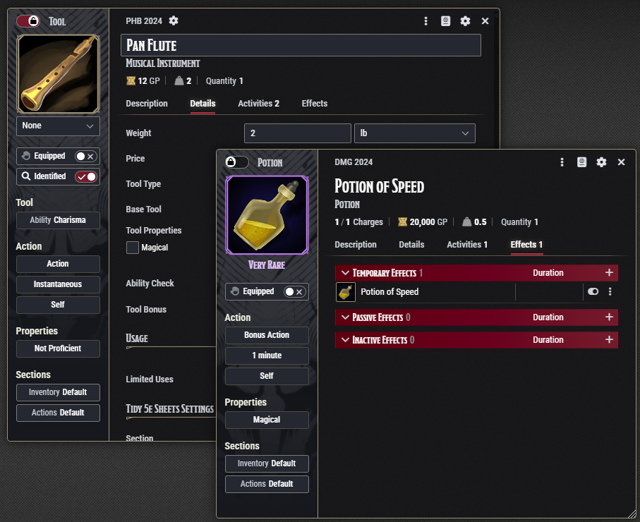

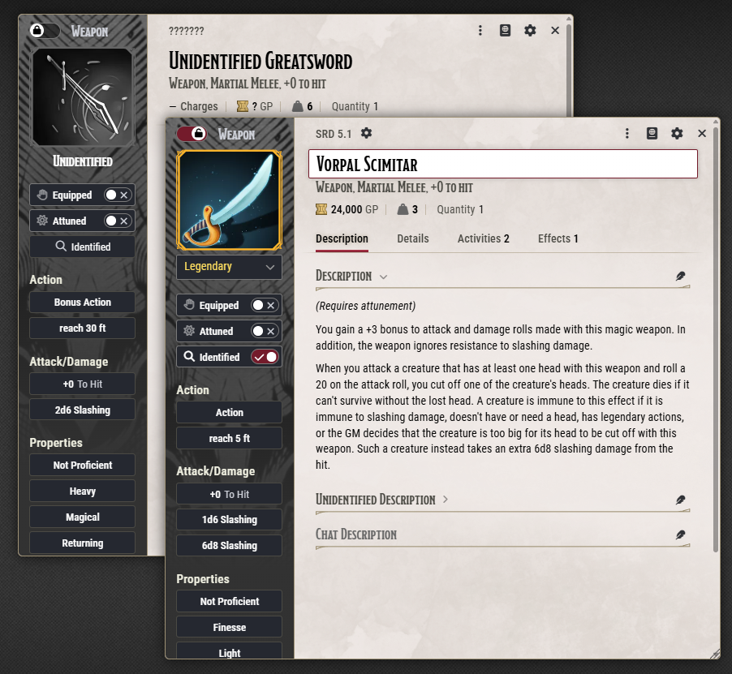

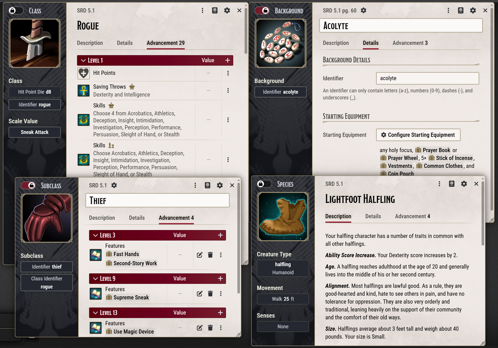

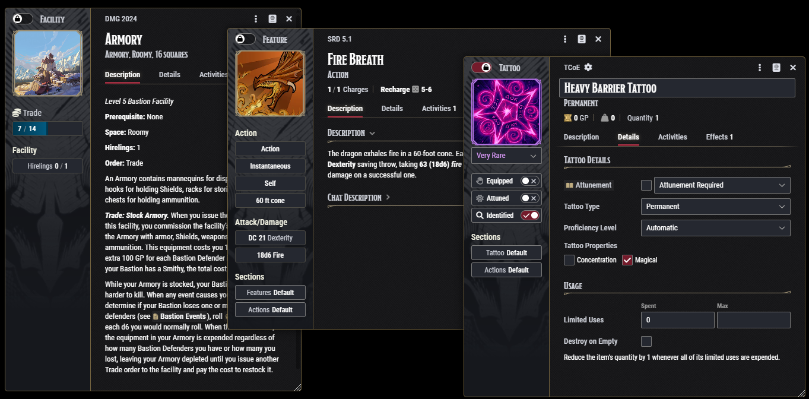

To make these sheets your own, select "Tidy 5e Container Sheet" / "Tidy 5e Item Sheet" on the Sheet Config dialog:

> [!NOTE]
> We want your feedback. Tell us how we did on the Tidy 5e community discord, or put in a github issue if you find something amiss.

---

## Behold, D&D 5e Sheets for Foundry VTT!

Tidy 5e sheets provides alternate layouts with extra features for [D&D 5e](https://github.com/foundryvtt/dnd5e) in [Foundry Virtual Tabletop](https://foundryvtt.com/).

### Character Sheets

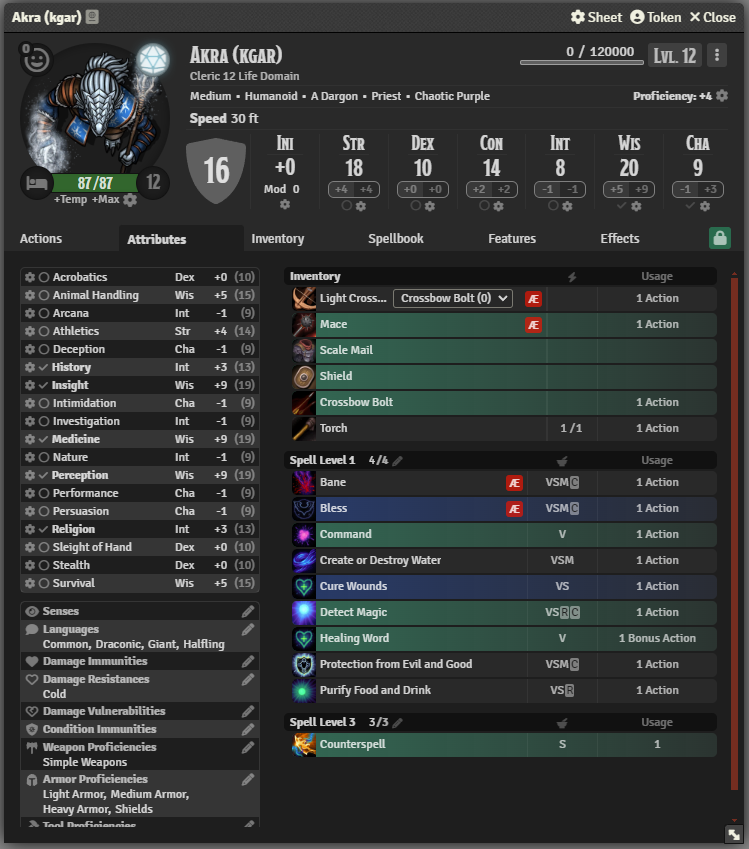

### NPC Sheets

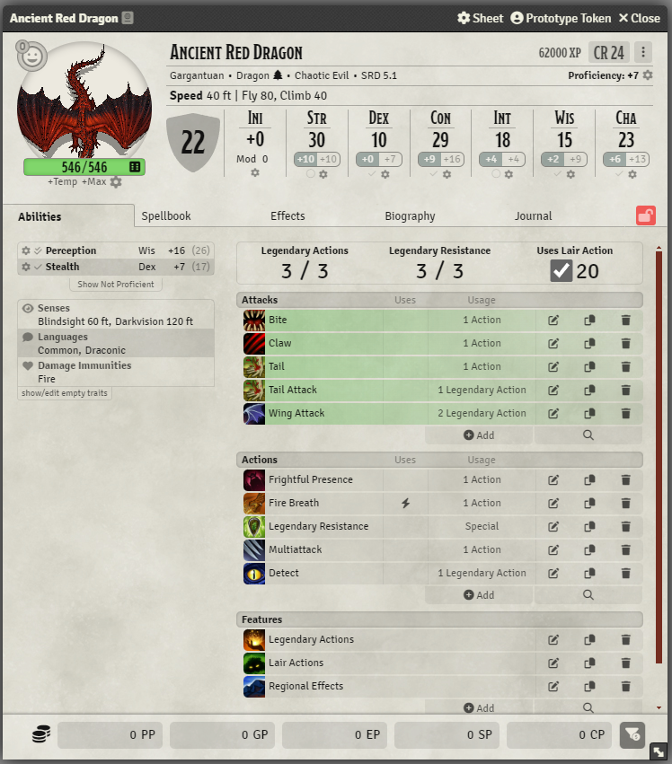

### Vehicle Sheets

### Customizable

Tab selection:

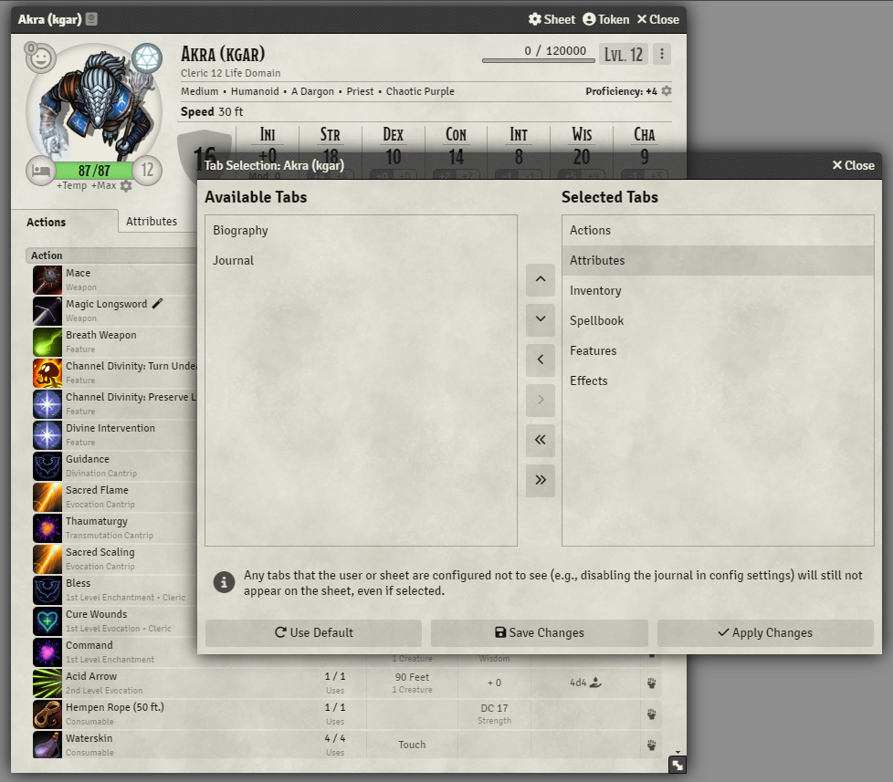

Theme settings:

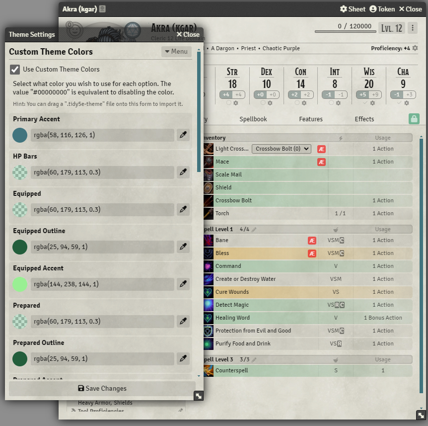

Dark Mode:

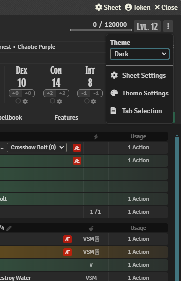

High GM and player customizability:

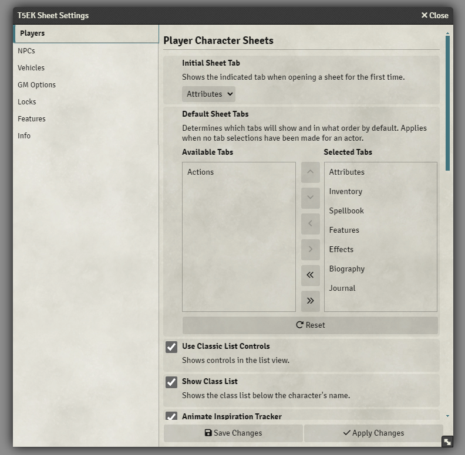

*And much more!*

### API-Extensible Sheets

The [Tidy 5e Sheets API](https://kgar.github.io/foundry-vtt-tidy-5e-sheets/) is here to allow for extending the sheets in a variety of supported ways. Because this module uses alternate web technology from the normal Foundry sheets, integrating by API is essential for other modules and for those making world scripts.

#### Need API Functions for Something? Let's Talk

If you need API support for a feature or customization that you have in mind, submit a [github issue](https://github.com/kgar/foundry-vtt-tidy-5e-sheets/issues) or begin a discussion in the community discord.

## Reporting Issues and Requesting Features

If you are experiencing a bug or have an idea for a new feature, submit a [github issue](https://github.com/kgar/foundry-vtt-tidy-5e-sheets/issues) or begin a discussion in the community discord.

## Module Compatibility

If a module is not compatible with Tidy 5e Sheets, submit a [github issue](https://github.com/kgar/foundry-vtt-tidy-5e-sheets/issues), and the author will work with other module authors to establish compatibility.

## Tidy 5e Sheets Manifesto

- Tidy 5e Sheets are meant to be nice sheets that make it easy to do D&D in style.
- Tidy 5e Sheets are intended to remain compatible with the current version of the dnd5e system, including mirroring its Foundry compatibility settings. When there's a system update that has breaking changes, Tidy 5e Sheets will move all current efforts forward to the new dnd5e version and adjust its minimum system version accordingly.
- This module cannot and should not try to bootstrap all sheet-augmenting modules within its own source code. Modules come and go.
- This module should not become a Kitchen Sink module. Requests that go out of scope cannot be fulfilled.
- This is a community effort. The Maintainer(s) strive to keep an open dialogue with interested users / devs while continuing maintenance and adding features.
