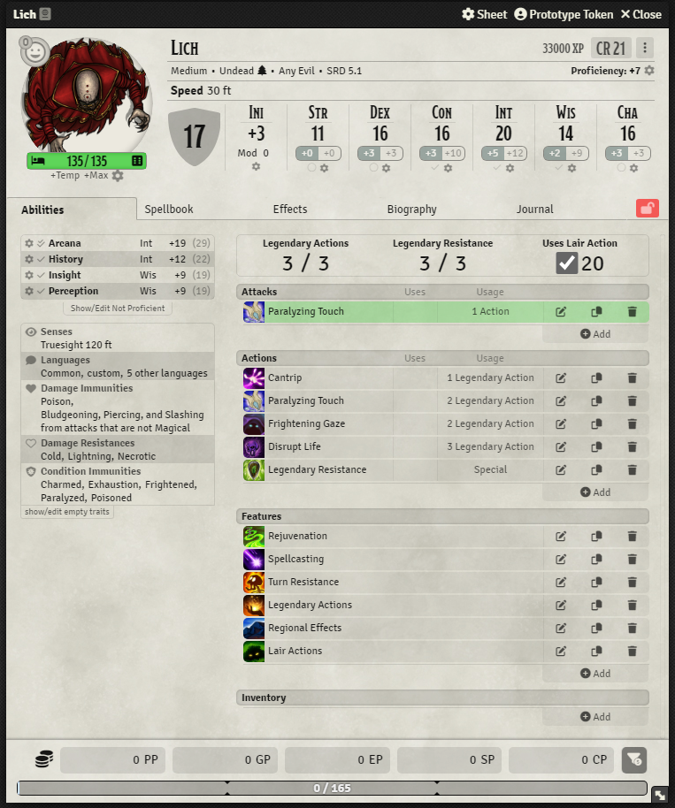
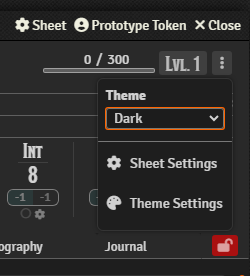
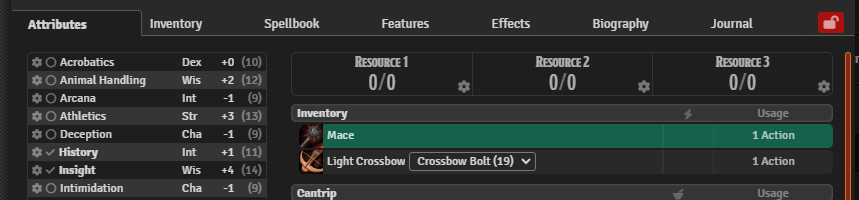
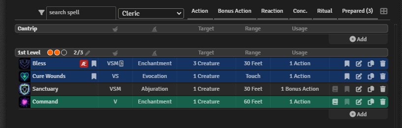
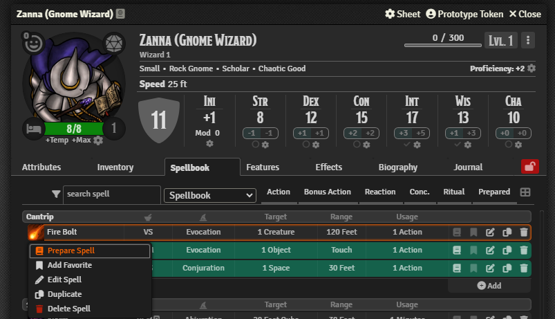
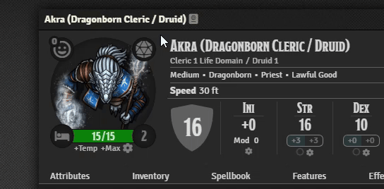
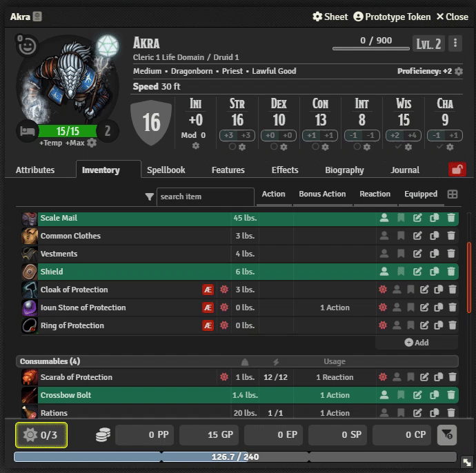
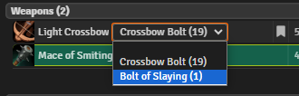

# Tidy 5e Sheets

      

D&D 5e sheet layouts for Foundry VTT, focused on a clean UI, user ergonomics, and extensibility.

Completely rewritten from the ground up, based on the [Tidy5e Sheet](https://github.com/sdenec/tidy5e-sheet) module by [sdenec](https://github.com/sdenec) and [4535992](https://github.com/p4535992).

 | Support me on [Patreon](https://www.patreon.com/user?u=103973827) | 

> **Warning**  
> This is an alpha testing module that is subject to numerous breaking changes and rapid updates.
>
> It is recommended that you do not alpha test these sheets on your actual game world.  
> **Use at your own risk.**

## Installation

During alpha testing, this module is installable manually by URL. It is not included in the Foundry modules list.

Manual installation instructions:

1. Inside the Foundry "Configuration and Setup" screen, click "Add-on Modules"
2. Click "Install Module"
3. In the "Manifest URL" field, paste the following url:
   `https://github.com/kgar/foundry-vtt-tidy-5e-sheets/releases/latest/download/module.json`
4. Click 'Install' and wait for installation to complete
5. Enable the module in your game using the "Manage Module" button.
6. Select the sheet layout from these options, depending on which sheet you are using:
   - Tidy 5e kgar Character Sheet
   - Tidy 5e kgar NPC Sheet
   - Tidy 5e kgar Vehicle Sheet
   - Tidy 5e kgar Item Sheet

> **Important**  
> During alpha testing, I am using a temporary module ID, `tidy5e-sheet-kgar`, and as a result, these sheets are intended to sit alongside the current Tidy5e sheet layouts. When alpha testing is over, these sheets will become the official Tidy5e sheets, meaning **all settings related to these test sheets during alpha testing will be forgotten after alpha testing.**
>
> Your character/NPC/vehicle/item core data will remain intact. This is the data that is included with the dnd5e system. However, certain module-specific data that you set up for these alpha sheets such as config settings, favorites, NPC/vehicular exhaustion, vehicle movement status, search filter text, spellbook class filter selection, theme settings, etc., will be forgotten. There will not be a migration because of the sheer amount of work remaining to get these sheets to version 1 status.

## Alpha Testing Goals

- Ensure the essential features of the sheets work as intended
- Add some of the requested features from the [Tidy5e rewrite commission discord thread](https://discord.com/channels/732325252788387980/1116078321067892796)

## Behold, D&D 5e Sheets for Foundry VTT!

Tidy 5e sheets provides alternate layouts with extra features for [D&D 5e](https://github.com/foundryvtt/dnd5e) in [Foundry Virtual Tabletop](https://foundryvtt.com/).

### Player Character Sheet

### NPC Sheet

### Vehicle Sheet

### Dark Mode

 

### Theme Settings

**Customize your theme colors** to give sheets the perfect tone for your game:

**Import/Export** themes and share with others:

### Enhanced Characters

Player character sheets come stocked with a variety of features above and beyond the standard 5e sheets.

#### Favorites

Tag your favorite items, spells, and features, and they will appear in the Attributes tab:

 

#### Multiclass Spellbook Filtering

For those who multiclass, optional Spellbook filtering allows players to assign their spells to specific classes and filter their spellbook by class.

> **Note**  
> Custom classes are also supported!

#### Spell Class Icons

For those who multiclass, Spell Class icons can delineate players' spells based on the spell's assigned class:

#### Cantrip Preparation (for Cantrip Formulas)

From "Tasha's Cauldron of Everything," the "Cantrip Formulas" feature allows wizards to prepare cantrips for the day. Tidy 5e optionally allows the preparation of cantrips:

#### Spell Slots Tracker

Add/remove spell slot points quickly with spell slot tracking:

#### More Character Detail Options

#### Animated Exhaustion Tracking

#### Animated Inspiration Tracking

### Item Cards

When enabled, item cards can provide a quick look at any hovered item, spell, or feature:

Also, there is an option to make item cards float near the mouse:

### Alternate Grid View

Inventory and spellbooks can be viewed in a convenient grid format:

### Attunement Tracker

The attunement tracker brings it to the player's attention that they are over-attuned:

### Max Prepared Spells

Keep track of your maximum prepared spells:

### Ammo Quick Switch

Swap ammo quickly using the ammo swap feature:

You can even swap ammo in the item card:

### Animated HP bars and Overlay

There is an optional, animated HP bar and HP overlay for each sheet type:

> [!todo]
> Finish the readme!

### Enhanced NPCs

#### NPC Rest

#### NPC Exhaustion Tacker

### Enhanced Vehicles

#### Vehicle Exhaustion Tracker

#### Vehicle Motion Tracker

#### Crew Action Economy Calculator

### Mod/Save Roll Buttons - Roll the Dice Even Faster!

### Sheet Lock

### Even More Sheet Lock - Optionally Lock Sensitive Fields

### Themable Colors with Live Updating

### Expand/Collapse Skills and Traits

### For Module Developers

### Module Compatibility

#### Built with Svelte for Smooth Reactivity

#### API-Extensible Sheets

#### Need API Functions for Something? Let's Talk

## And Much More!

TODO: Point to a user manual
TODO: Point to API documentation and examples

## Reporting Issues and Requesting Features

## Want to Build with Me?
