# Tidy 5e Sheets

     

D&D 5e sheet layouts for Foundry VTT, focused on a clean UI, user ergonomics, and extensibility.

Completely rewritten from the ground up, based on the [Tidy5e Sheet](https://github.com/sdenec/tidy5e-sheet) module by [sdenec](https://github.com/sdenec) and [4535992](https://github.com/p4535992).

> [!WARNING]
> **Use at your own risk.**
>
> This is an alpha testing module that is subject to numerous breaking changes and rapid updates.
>
> It is recommended that you do not alpha test these sheets on your actual game world.
>
> During alpha testing, various pieces of Tidy-specific data will not carry over from the original sheets to the alpha sheets and vice versa. If you have a sheet that is fully set up with the original Tidy 5e sheets, expect numerous fields to be reset to their default value when switching over to the new sheets.
>
> These fields include but are not limited to:
>
> - Journal and journal note fields
> - Favorites
> - Sheet Lock
> - Skill Expand/Collapse
> - Traits Expand/Collapse
> - List/Grid View Preference
> - Search Filter text
> - NPC Exhaustion Level
> - NPC Personality view toggle

> [!TIP]
> If you'd like to transfer Tidy-specific data from the original sheets to the alpha sheets and vice versa, you can use these macros:
>
> - [Copy Original Sheet Data to the Alpha Sheets](./macros/transfer-original-tidy-data-to-alpha.js)
> - [Copy Alpha Sheet Data to the Original Sheets](./macros/transfer-alpha-tidy-data-to-original.js)
>
> **DISCLAIMER**: Use at your own risk. These macros affect all actors and their items. It is recommended you back up your game world before performing this data transfer. This data transfer overwrites things like the journal and journal note fields.

---

## Module Compatibility Work Has Begun

Tidy 5e Sheets are built with different web tech and are structured differently than the default sheets, making compatibility not an automatic thing. As a result, efforts are underway to provide compatibility on a module-by-module basis, by way of this module adding API functions and hooks for module devs to hook into and augment the sheets in various ways. The modules whose compatibility has been requested in a [github issue](https://github.com/kgar/foundry-vtt-tidy-5e-sheets/issues) are being evaluated first.

In many cases, this will require changes to this module and to the module with which we want to be compatible. For this reason, there will be periods where we are awaiting the result of a submitted Pull Request to another module.

### World Scripts Available

Sometimes, however, I will not be able to provide compatibility through changes to the other module, and to avoid the past mistakes with Tidy 5e Sheets, this rewrite does not embed other modules' integrating code into the source code, because for one sheets module, there are thousands+ sheet augmenting modules. Over time, some modules come and go, and the integrating code remains behind 😢—Tidy becomes untidy and unmaintainable.

For whatever reason, if I am unable to work with the module author to come up with a solution on their end, but a solution is available that doesn't require changing their module, I will endeavor to have a world script available which can patch in the necessary changes. These scripts can be found here: https://github.com/kgar/foundry-vtt-tidy-5e-sheets/tree/main/compatibility/world-scripts. World scripts of this nature come with the specific disclaimer to use at your own risk.

If fixes are needed to world scripts that integrate with other modules, submit a [github issue](https://github.com/kgar/foundry-vtt-tidy-5e-sheets/issues), linking the affected world script, what is wrong, and what should be happening.

## How to Support Tidy 5e Sheets

Tidy 5e is a community effort. Development logs, feature discussion, troubleshooting, dreaming, and more can be found on [discord](https://discord.com/channels/1167985253072257115/1167985253512650755). 

Sheets development is a longterm commitment, subject to every Foundry and dnd5e system update, so any support is greatly appreciated.

 

Tidy 5e Sheets also has a [Patreon](https://www.patreon.com/iamkgar).

## Installation

During alpha testing, this module is installable manually by URL. It is not included in the Foundry modules list.

Manual installation instructions:

1. Inside the Foundry "Configuration and Setup" screen, click "Add-on Modules"
2. Click "Install Module"
3. In the "Manifest URL" field, paste the following url:
   `https://github.com/kgar/foundry-vtt-tidy-5e-sheets/releases/latest/download/module.json`
4. Click 'Install' and wait for installation to complete
5. Enable the module in your game using the "Manage Module" button.
6. Select the sheet layout from these options, depending on which sheet you are using:
   - Tidy 5e kgar Character Sheet
   - Tidy 5e kgar NPC Sheet
   - Tidy 5e kgar Vehicle Sheet
   - Tidy 5e kgar Item Sheet

## Alpha Testing Goals

- Ensure the essential features of the sheets work as intended
- Add some of the requested features from the [Tidy5e rewrite commission discord thread](https://discord.com/channels/732325252788387980/1116078321067892796)

## Behold, D&D 5e Sheets for Foundry VTT!

Tidy 5e sheets provides alternate layouts with extra features for [D&D 5e](https://github.com/foundryvtt/dnd5e) in [Foundry Virtual Tabletop](https://foundryvtt.com/).

### Player Character Sheet

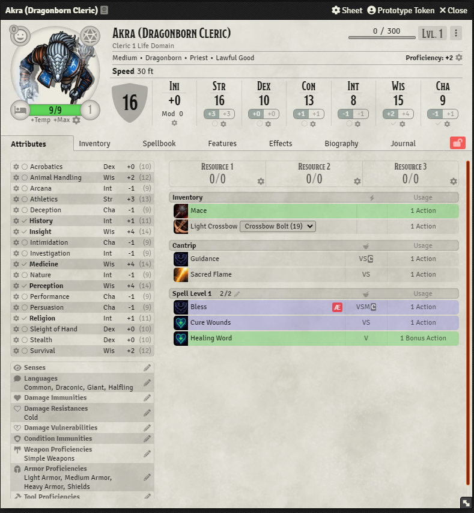

### NPC Sheet

### Vehicle Sheet

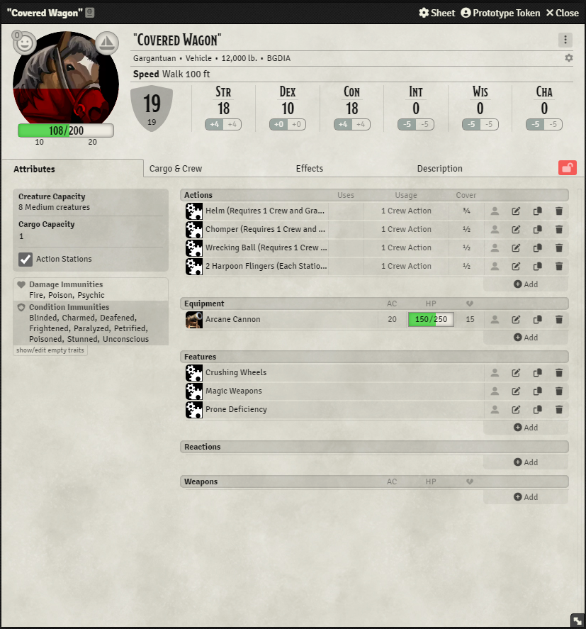

### Dark Mode

 

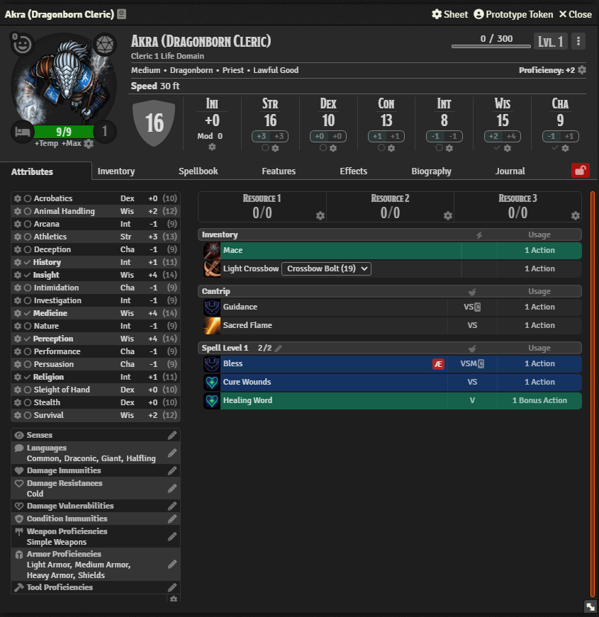

### Theme Settings

**Customize your theme colors** to give sheets the perfect tone for your game:

**Import/Export** themes and share with others:

### Enhanced Characters

Player character sheets come stocked with a variety of features above and beyond the standard 5e sheets.

#### Favorites

Tag your favorite items, spells, and features, and they will appear in the Attributes tab:

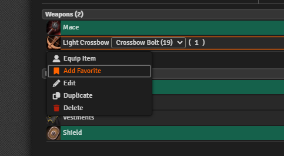 

#### Multiclass Spellbook Filtering

For those who multiclass, optional Spellbook filtering allows players to assign their spells to specific classes and filter their spellbook by class.

> **Note**  
> Custom classes are also supported!

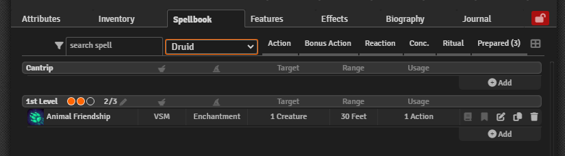

#### Spell Class Icons

For those who multiclass, Spell Class icons can delineate players' spells based on the spell's assigned class:

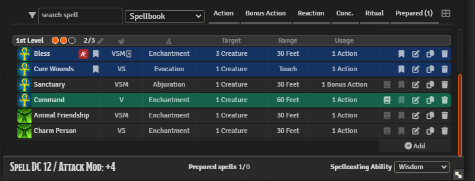

#### Cantrip Preparation (for Cantrip Formulas)

From "Tasha's Cauldron of Everything," the "Cantrip Formulas" feature allows wizards to prepare cantrips for the day. Tidy 5e optionally allows the preparation of cantrips:

#### Spell Slots Tracker

Add/remove spell slot points quickly with spell slot tracking:

#### More Character Detail Options

#### Animated Exhaustion Tracking

#### Animated Inspiration Tracking

### Item Cards

When enabled, item cards can provide a quick look at any hovered item, spell, or feature:

Also, there is an option to make item cards float near the mouse:

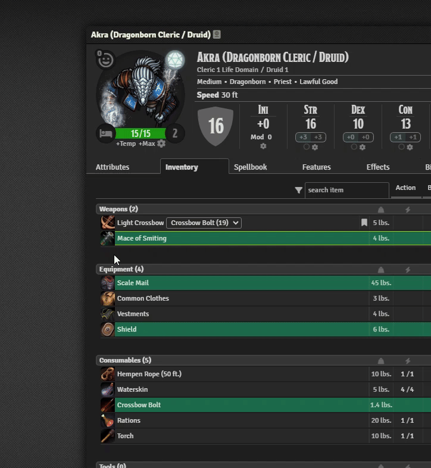

### Alternate Grid View

Inventory and spellbooks can be viewed in a convenient grid format:

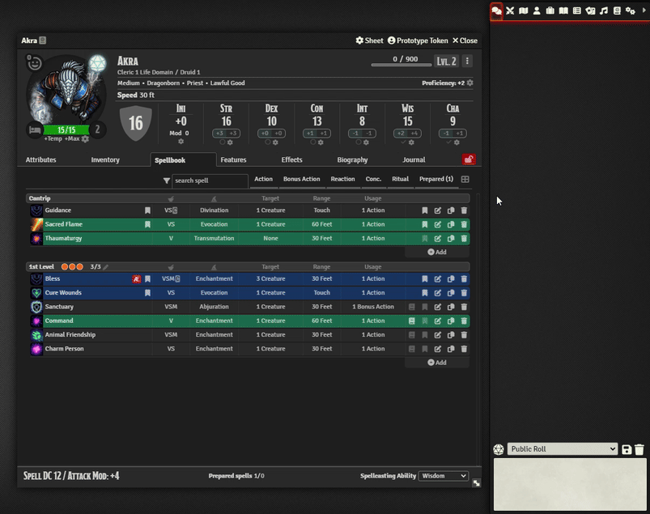

### Attunement Tracker

The attunement tracker brings it to the player's attention that they are over-attuned:

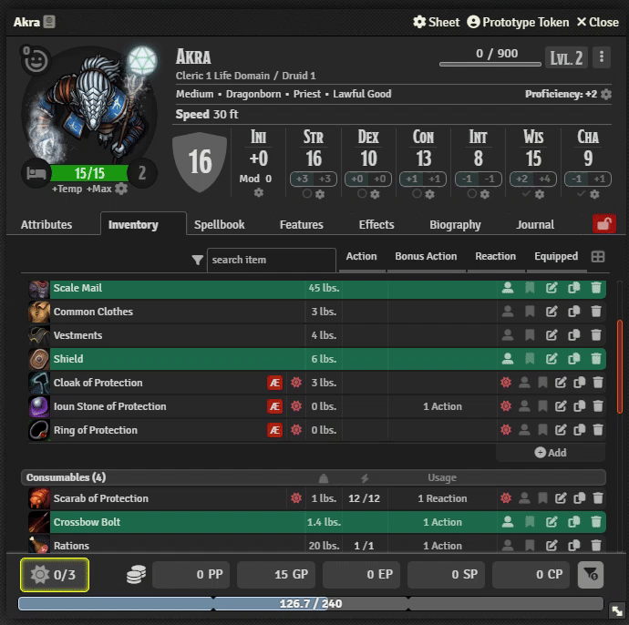

### Max Prepared Spells

Keep track of your maximum prepared spells:

### Ammo Quick Switch

Swap ammo quickly using the ammo swap feature:

You can even swap ammo in the item card:

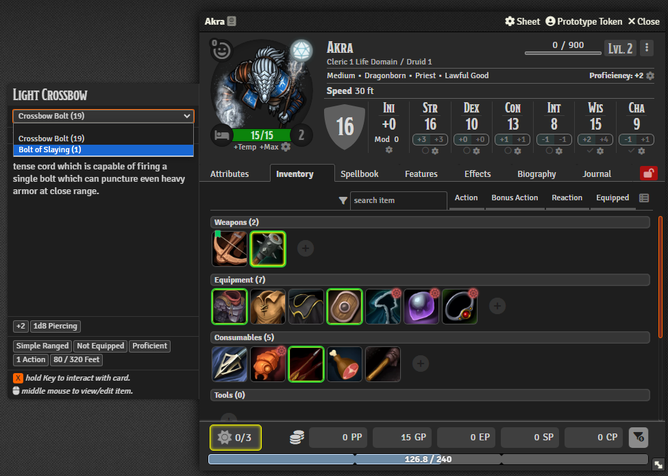

### Animated HP bars and Overlay

There is an optional, animated HP bar and HP overlay for each sheet type:

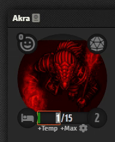

> [!todo]
> Finish the readme!

### Enhanced NPCs

#### NPC Rest

#### NPC Exhaustion Tacker

### Enhanced Vehicles

#### Vehicle Exhaustion Tracker

#### Vehicle Motion Tracker

#### Crew Action Economy Calculator

### Mod/Save Roll Buttons - Roll the Dice Even Faster!

### Sheet Lock

### Even More Sheet Lock - Optionally Lock Sensitive Fields

### Themable Colors with Live Updating

### Expand/Collapse Skills and Traits

### For Module Developers

### Module Compatibility

#### Built with Svelte for Smooth Reactivity

#### API-Extensible Sheets

#### Need API Functions for Something? Let's Talk

## And Much More!

TODO: Point to a user manual
TODO: Point to API documentation and examples

## Reporting Issues and Requesting Features

## Want to Build with Me?

See the [CONTRIBUTING](https://github.com/kgar/foundry-vtt-tidy-5e-sheets/blob/main/CONTRIBUTING.md) page.

## Tidy 5e Sheets Manifesto

- Tidy 5e Sheets are meant to be nice sheets that make it easy to do D&D in style.
- Tidy 5e Sheets are intended to remain compatible with the current version of the dnd5e system, including mirroring its Foundry compatibility settings. When there's a system update that has breaking changes, Tidy 5e Sheets will move all current efforts forward to the new dnd5e version and adjust its minimum system version accordingly.
- This module cannot and should not try to bootstrap all sheet-augmenting modules within its own source code. Modules come and go.
- This module should not become a Kitchen Sink module. Requests that go out of scope cannot be fulfilled.
- This is a community effort. The Maintainer(s) strive to keep an open dialogue with interested users / devs while continuing maintenance and adding features.
