# Tidy 5e Sheets

     

## What are Tidy 5e Sheets?

Alternate [D&D 5e](https://github.com/foundryvtt/dnd5e) sheet layouts for [Foundry Virtual Tabletop](https://foundryvtt.com/), focused on a clean UI, usability, flexibility, and extensibility.

Completely rewritten from the ground up, based on the original [Tidy5e Sheet](https://github.com/sdenec/tidy5e-sheet) module by [sdenec](https://github.com/sdenec) and [4535992](https://github.com/p4535992), and the excellent foundation laid by the 5e system module.

| Helpful links | In this document |
| ------------- | ----------- |
| [Foundry Package](<https://foundryvtt.com/packages/tidy5e-sheet/>) | [Installation guide](https://github.com/kgar/foundry-vtt-tidy-5e-sheets#installation) |
| [Tidy 5e Sheets API](https://kgar.github.io/foundry-vtt-tidy-5e-sheets/) | [Sheet overview](https://github.com/kgar/foundry-vtt-tidy-5e-sheets#tidy-5e-sheets-ui) |
| [Tidy 5e Wiki](https://github.com/kgar/foundry-vtt-tidy-5e-sheets/wiki) | [Reporting issues](https://github.com/kgar/foundry-vtt-tidy-5e-sheets#reporting-issues)|
| | [API-Extensible Sheets](https://github.com/kgar/foundry-vtt-tidy-5e-sheets#api-extensible-sheets) |
| | [Module Compatibility](https://github.com/kgar/foundry-vtt-tidy-5e-sheets#module-compatibility) |
| | [Tidy 5e Sheets Manifesto](https://github.com/kgar/foundry-vtt-tidy-5e-sheets#tidy-5e-sheets-manifesto) |

## Get Involved

Tidy runs on community feedback! If you like something you see, reach out in the [Tidy 5e Sheets community Discord](https://discord.gg/865zzNscRA), or put in a [GitHub issue](https://github.com/kgar/foundry-vtt-tidy-5e-sheets/issues) if you find something amiss.

### **kgar**  • 📜 The Keeper of Sheets, Head Modron 👨‍💻 development, ✨ some design

 

### **hightouch** • Rogue Modron ✨ design, 👨‍💻 some development

### Community Discord

Join us on the [Tidy 5e Sheets community discord](https://discord.gg/865zzNscRA) to receive insider updates, dream up new features, report bugs more easily than GitHub, and or just say hi.

&nbsp;

## Installation

We recommend installing this module through Foundry, the Forge Bazaar, or a similar interface for official Foundry packages.

Or, you can still install Tidy manually via the `module.json` URL:

1. Inside the initial Foundry Configuration and Setup screen, open the **Add-on Modules** tab.
2. Press the **Install Module** button.
3. In the **Manifest URL** field, paste in a manifest URL. The "Latest Stable" URL is: 
   `https://github.com/kgar/foundry-vtt-tidy-5e-sheets/releases/latest/download/module.json`
   - See [the foundry package page](<https://foundryvtt.com/packages/tidy5e-sheet/>) for Last Versions for different dnd5e system versions.
4. Press **Install** and wait for installation to complete.
   
### Quick start

1. Enable the module in your game in the **Game Settings** sidebar tab, pressing the **Manage Modules** button and activating **Tidy 5e Sheets**. This activates the module, but you still need to switch sheets to Tidy verions. 
2. Change individual sheets to Tidy using the **three-dot Toggle Controls menu** at the top of each sheet and choosing **Configure sheet.**
3. Globally change all sheets from the **Game Settings** sidebar tab, choosing **Configure Settings**. Here you can change **Core** → **Configure Default Sheets**, or **Tidy 5e Sheets** → **Set Tidy as Default Sheet**.

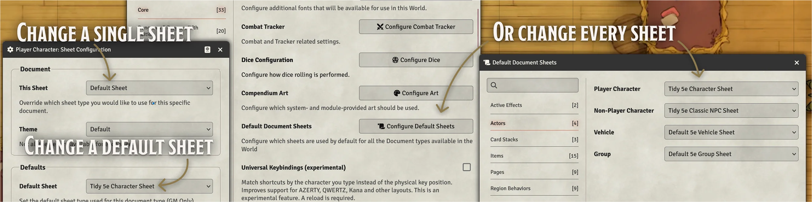

&nbsp;

## Tidy 5e Sheets UI

⚙️ The new Tidy 5e Sheets overhaul, codenamed Quadrone, has begun, and we are gradually releasing new sheets into the beta. ⚙️ To make these sheets your own, change to the new **Tidy 5e Sheet** options in the Sheet Configuration pages.

> [!NOTE]
> **From kgar**:
> Do you like what you see? Please consider thanking hightouch for giving us his time and expertise in graphic design by visiting his [ko-fi](<https://ko-fi.com/hightouch>). This is all volunteer work, but saying thanks with a cup of coffee is a gesture that goes a long way!
> 
> The community has been generous to me for my efforts with this module. With that said, this next chapter in Tidy's history is, in a large part, thanks to hightouch's willingness to give of himself and work with the community and me to give Tidy an amazing new look while preserving all the functional things that users have come to rely upon.

| Item Sheets Progress | Actor Sheets Progress |
| ---- | ---- |
| ✅ Background  | ✅ Character |
| ✅ Class  | ✅ NPC |
| ✅ Consumable  | ✅ Group  |
| ✅ Container  | ✅ Encounter |
| ✅ Equipment | ⬜ Vehicle |
| ✅ Facility | |
| ✅ Feat | |
| ✅ Loot | |
| ✅ Species | |
| ✅ Spell | |
| ✅ Subclass | |
| ✅ Tattoo | |
| ✅ Tool | |
| ✅ Weapon | |

&nbsp;

## Character sheets
Evocative character sheets that give players and DMs more control, with more ways of sorting, filtering, and organizing character details.

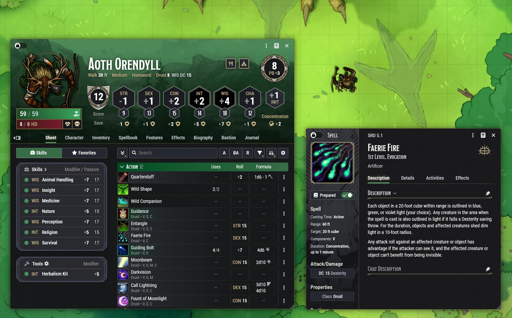
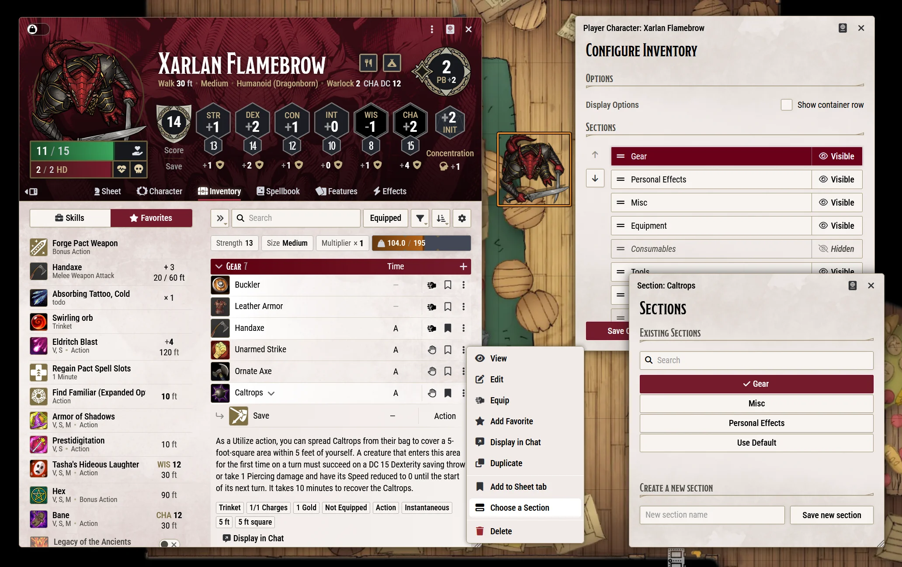
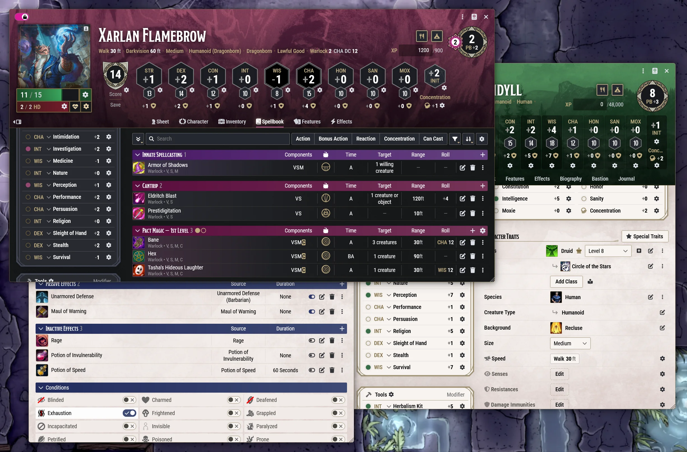
*Dragonborn Warlock Channels Magic by [Iqnatius Budi](https://b03di.artstation.com/), © Wizards of the Coast.*
 
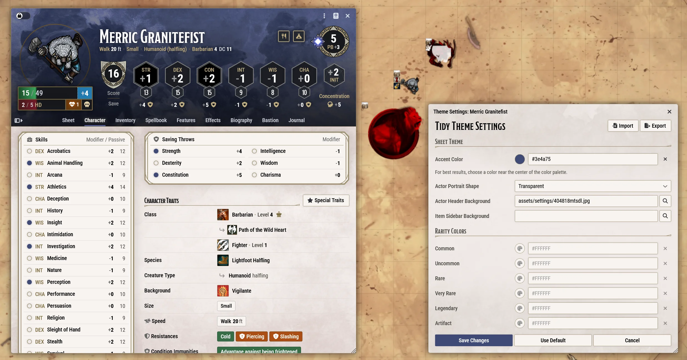

### What's unique about Tidy's Character sheets?

| Core Functionality | New Features |
| --- | --- |
| Custom sheet themes, colors, and images | Custom sections |
| Sidebar for quick access to Favorites and Skills | Hidden Tabs |
| Sheet tab for all a character's most used items, grouped by action | Journal Tab |
| Easy module integration | Extensible inspiration and exhaustion |
| Fully expandable containers | Easy to expand items |
| Quick edit with middle click, open with double-click | Expanded context menus |
| Responsive design | Rarity colors |

&nbsp;

## Item sheets

An alternate view of items that brings more functionality to the surface.

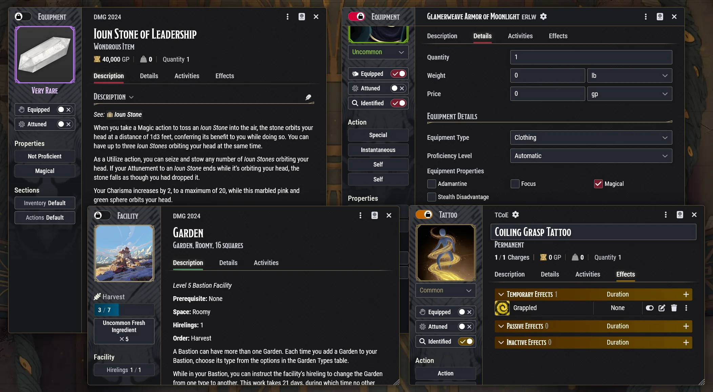
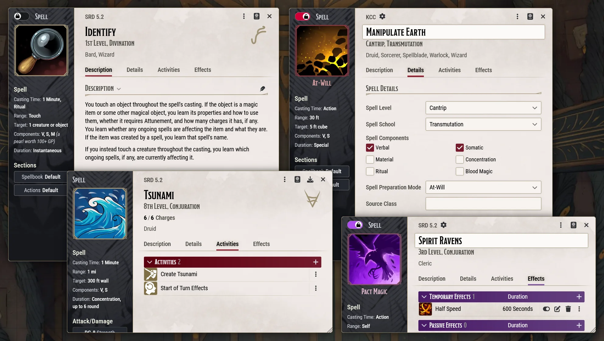
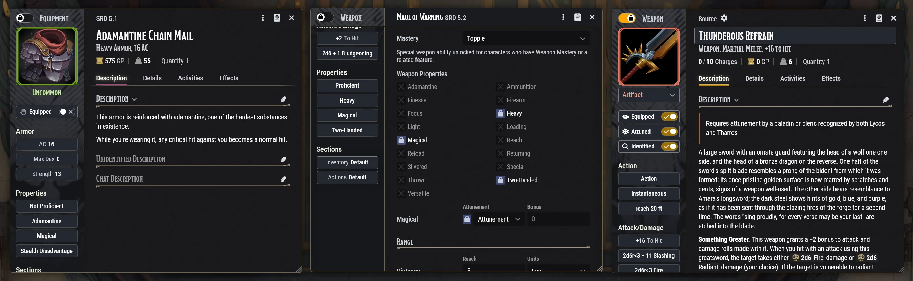
*Thundrous Refrain image by community member [CRASH](https://github.com/crash1115), all rights reserved.*
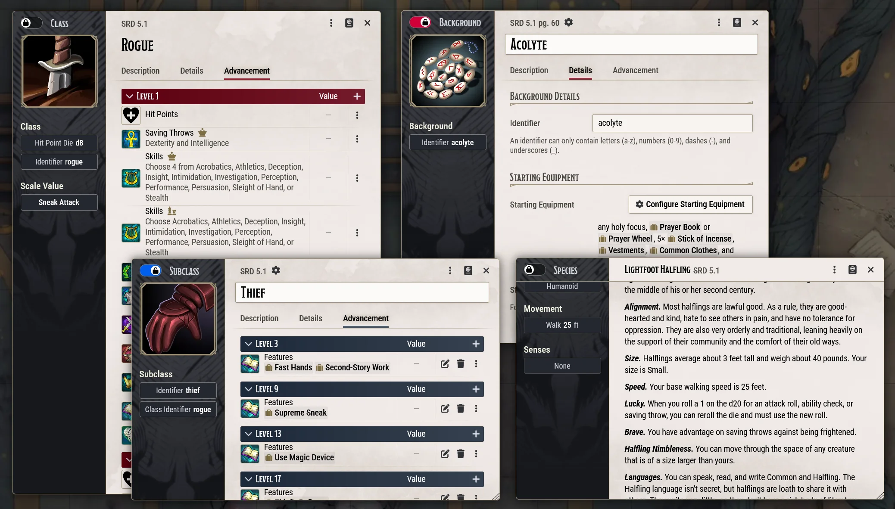

### What's unique about Tidy's item sheets?

| Core Functionality | Additional Features |
| --- | --- |
| All reference data on one page | Additional item fields |
| All editable data on one page | Section selection |
| Equip, attune, identify from the sidebar | Prominent rarity/spellcasting mode theming |
| Container contents as powerful as Character inventory | Player identification optionally hidden |
| Fully themed descriptions including statblocks | Feat origin source selection |
| Resizable and responsive sheets | |

&nbsp;

## NPC Sheets

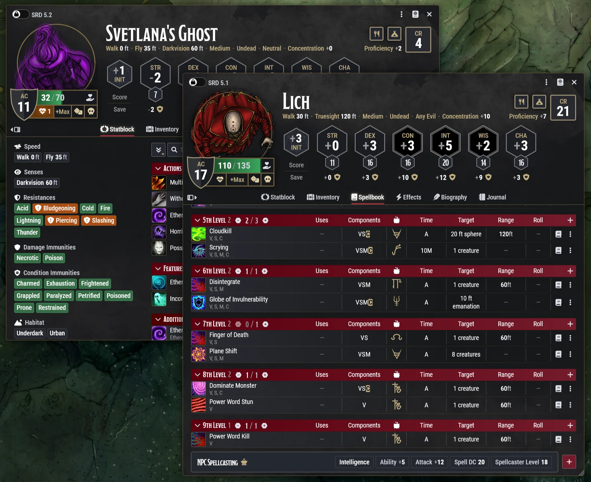
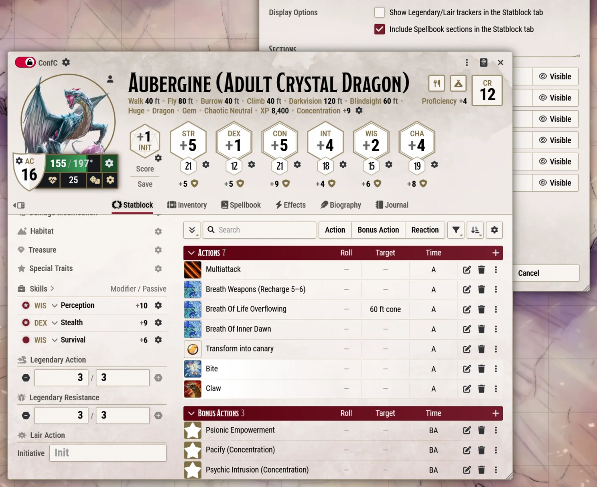
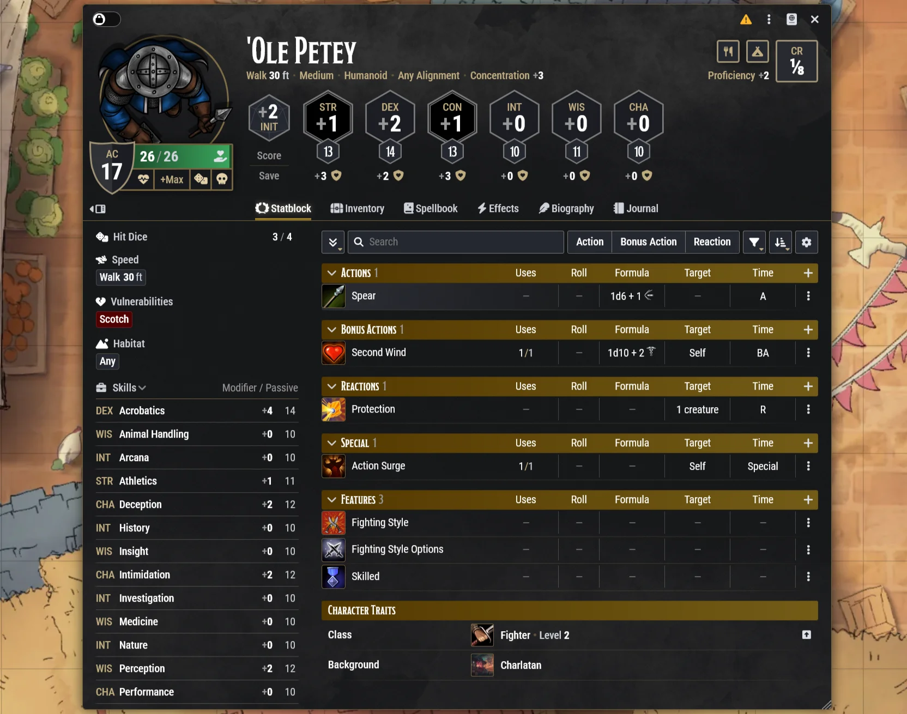

### What's unique about Tidy's NPC sheets?

| Core Functionality | Additional Features |
| --- | --- |
| Sheets closely aligned with character sheet functionality | Tab selection |
| Detailed tables with drag and drop, sorting, and filtering | Custom sections |
| Statblock tab with all traits, actions, and spells in one place | NPC journal |
| HP and vitals in one spot similar to character sheets | Roll HP |

&nbsp;

## Vehicle Sheets

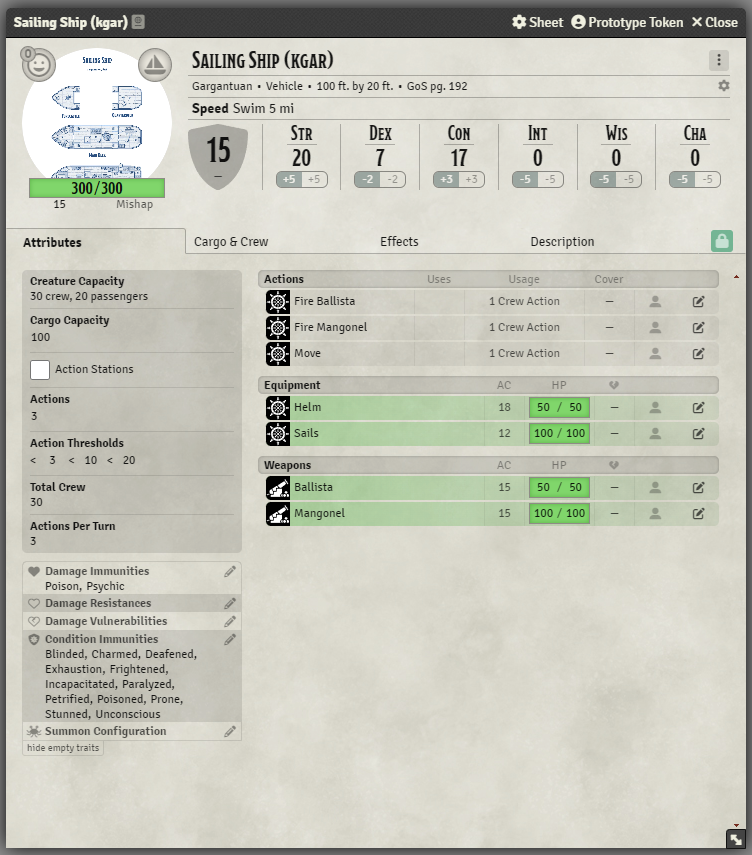

### What's unique about Tidy's Vehicle sheets?

| Core Functionality | Additional Features |
| --- | --- |
| Sheets closely aligned with character sheet functionality | Combined attributes and features |
| Detailed tables with drag and drop, sorting, and filtering |  |

&nbsp;

## Group Sheets

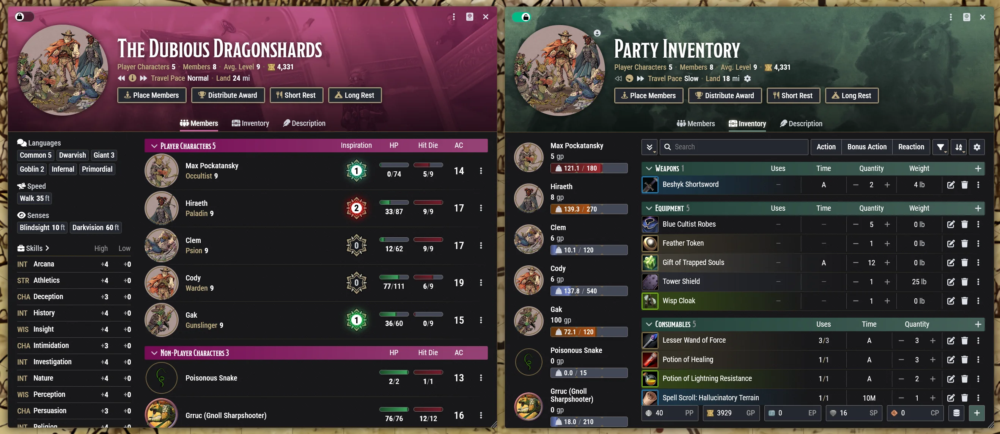
*Adventuring Party commissioned work by [Sar Cousins](https://sarcousins.co.uk/), © Sar Cousins.

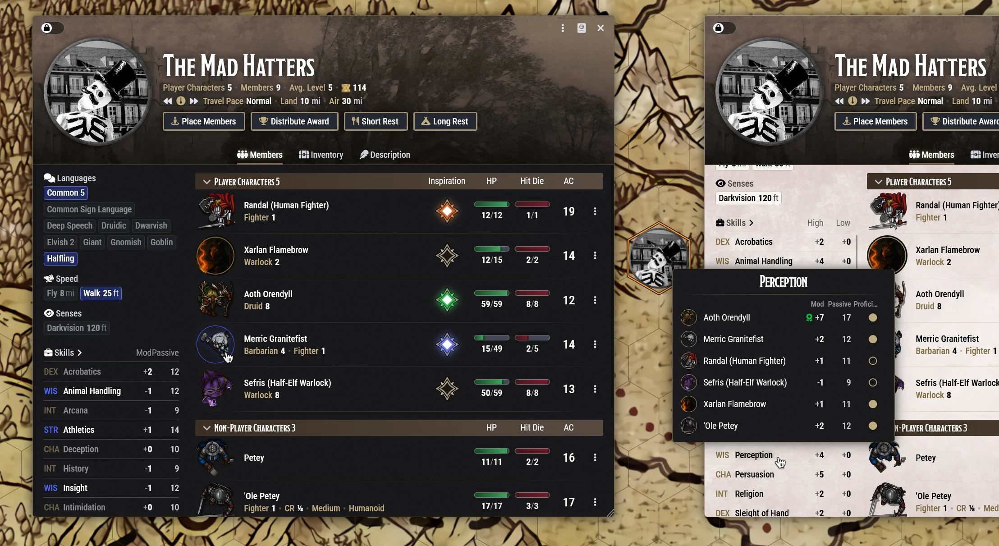

### What's unique about Tidy's Group sheets?

| Core Functionality | Additional Features |
| --- | --- |
| At a glance party traits, stats, and skills | Party languages and skills lists |
| Hover states to show and compare individual member abilities | High / Low / Passive stats |
| Inventory sorting, filtering, and customization matching other sheets | Hide and reorder sections |
| Group sheet theming | Party inspiration |

&nbsp;

## Encounter Sheets

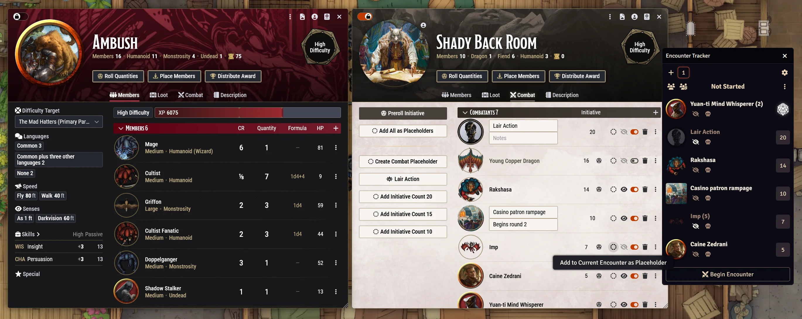

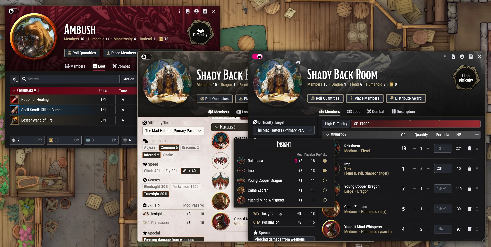

### What's unique about Tidy's Encounter sheets?

| Core Functionality | Additional Features |
| --- | --- |
| Combat tab to pre-build encounters, initiative, and placeholders to start encounters quickly | Create placeholders for groups of creatures |
| At a glance encounter makeup. Traits, stats, languages, and skills. | Encounter sheet theming |
| Structure mirroring all other sheets | Total gold calculation |

&nbsp;

## Reporting Issues and Requesting Features

If you are experiencing a bug or have an idea for a new feature, submit a [github issue](https://github.com/kgar/foundry-vtt-tidy-5e-sheets/issues) or begin a discussion in the community discord.

## API-Extensible Sheets

The [Tidy 5e Sheets API](https://kgar.github.io/foundry-vtt-tidy-5e-sheets/) is here to allow for extending the sheets in a variety of supported ways. Because this module uses alternate web technology from the normal Foundry sheets, integrating by API is essential for other modules and for those making world scripts.

#### Need API Functions for Something? Let's Talk

If you need API support for a feature or customization that you have in mind, submit a [github issue](https://github.com/kgar/foundry-vtt-tidy-5e-sheets/issues) or begin a discussion in the community discord.

## Module Compatibility

If a module is not compatible with Tidy 5e Sheets, submit a [github issue](https://github.com/kgar/foundry-vtt-tidy-5e-sheets/issues), and the author will work with other module authors to establish compatibility.

## Tidy 5e Sheets Manifesto

- Tidy 5e Sheets are meant to be nice sheets that make it easy to do D&D in style.
- Tidy 5e Sheets are intended to remain compatible with the current version of the D&D 5e system, including mirroring its Foundry compatibility settings. When there's a system update that has breaking changes, Tidy 5e Sheets will move all current efforts forward to the new D&D 5e version and adjust its minimum system version accordingly.
- This module cannot and should not try to bootstrap all sheet-augmenting modules within its own source code. Modules come and go.
- This module should not become a Kitchen Sink module. Requests that go out of scope cannot be fulfilled.
- This is a community effort. The Maintainer(s) strive to keep an open dialogue with interested users / devs while continuing maintenance and adding features.
